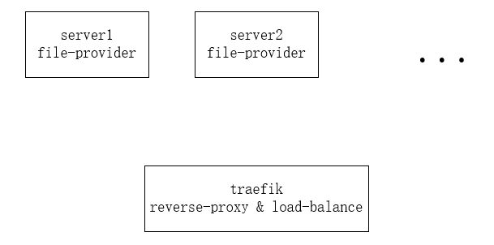

# traefik-examples
this repository include configurations of some use cases of [traefik](https://traefik.io/). 

## quick-start
traefik offical quick start [demo](https://docs.traefik.io/getting-started/quick-start/).

## file-provider
it's used as traditions reverse proxy and load balance service.  
+ file providers are supposed to run either on `traefik server`(server running traefik service) or another server.
+ easy to expand providers to support large requests dynamically. 

### proposal arch

## certs
example for automatically register let's encrypt certs (http challenge).

## http-to-https
redirect http to https.

## docker-provider
